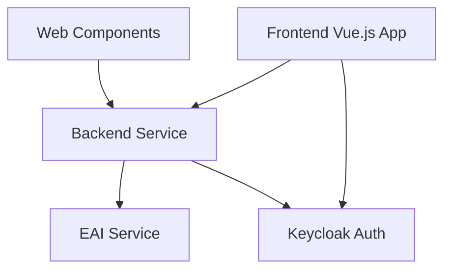

# TrafficGCN

A modern microservices-based application demonstrating enterprise architecture patterns.

## System Requirements

### Backend Development
- Java Development Kit (JDK) 21
- Maven (for dependency management)

### Frontend Development
- Node.js (version >=18 and <=20)
- npm (included with Node.js)

## Project Structure

The project consists of several components:

- `refarch-backend/`: Spring Boot backend service
- `refarch-frontend/`: Vue.js 3 frontend application
- `refarch-eai/`: Enterprise Application Integration service
- `refarch-webcomponent/`: Reusable Vue.js web components
- `stack/`: Docker Compose configuration and Keycloak setup

## Setup Instructions

### Database Setup

The application uses PostgreSQL as its database. You can set it up using either Docker or a native installation.

#### Option 1: Using Docker (Recommended)

1. Pull and run PostgreSQL container:
   ```bash
   docker run --name refarch-postgres \
     -e POSTGRES_USER=admin \
     -e POSTGRES_PASSWORD=admin \
     -p 5432:5432 \
     -d postgres:latest
   ```

#### Option 2: Native Installation

1. Install PostgreSQL from the [official website](https://www.postgresql.org/download/)
2. Start the PostgreSQL service
3. Create a new user and database:
   ```sql
   CREATE USER admin WITH PASSWORD 'admin';
   ALTER USER admin WITH SUPERUSER;
   ```

#### Verify Database Connection

The application is configured to connect to:
- Host: localhost
- Port: 5432
- Database: postgres
- Username: admin
- Password: admin

Note: The application will automatically create and manage the database schema when it starts, as it's configured with `spring.jpa.hibernate.ddl-auto: create-drop`.

### Backend Setup

1. Install JDK 21
2. Navigate to the backend directory:
   ```bash
   cd refarch-backend
   ```
3. Run the application:
   - With security: `./runLocal.sh` (Linux/Mac) or `runLocal.bat` (Windows)
   - Without security: `./runLocalNoSecurity.sh` (Linux/Mac) or `runLocalNoSecurity.bat` (Windows)

### Frontend Setup

1. Install Node.js (version 18-20)
2. Navigate to the frontend directory:
   ```bash
   cd refarch-frontend
   ```
3. Install dependencies:
   ```bash
   npm install
   ```
4. Available commands:
   - `npm run dev`: Start development server
   - `npm run build`: Build for production
   - `npm run preview`: Preview production build
   - `npm run test`: Run tests
   - `npm run lint`: Check code quality
   - `npm run fix`: Fix code style issues

### Web Component Setup

1. Navigate to the web component directory:
   ```bash
   cd refarch-webcomponent
   ```
2. Install dependencies:
   ```bash
   npm install
   ```
3. Available commands:
   - `npm run dev`: Start development server
   - `npm run build`: Build for production
   - `npm run preview`: Preview production build
   - `npm run test`: Run tests
   - `npm run lint`: Check code quality
   - `npm run fix`: Fix code style issues

## Docker Support

Each component includes a Dockerfile for containerization. To run the entire stack:

1. Navigate to the stack directory:
   ```bash
   cd stack
   ```
2. Start the services:
   ```bash
   docker-compose up
   ```
## macOS Setup Guide

### Prerequisites Installation

1. Install Homebrew (Package Manager):
   ```bash
   /bin/bash -c "$(curl -fsSL https://raw.githubusercontent.com/Homebrew/install/HEAD/install.sh)"
   ```

2. Install Git:
   ```bash
   brew install git
   ```

3. Install Java 21:
   ```bash
   brew install openjdk@21
   echo 'export PATH="/opt/homebrew/opt/openjdk@21/bin:$PATH"' >> ~/.zshrc
   source ~/.zshrc
   ```

4. Install Maven:
   ```bash
   brew install maven
   ```

5. Install Node.js:
   ```bash
   brew install node@20
   echo 'export PATH="/opt/homebrew/opt/node@20/bin:$PATH"' >> ~/.zshrc
   source ~/.zshrc
   ```

### Database Setup

1. Install PostgreSQL:
   ```bash
   brew install postgresql@15
   brew services start postgresql@15
   brew link postgresql@15 --force
   ```

2. Create database user:
   ```bash
   psql postgres
   CREATE USER admin WITH PASSWORD 'admin';
   ALTER USER admin WITH SUPERUSER;
   \q
   ```

### Project Setup

1. Clone the repository:
   ```bash
   git clone <repository-url>
   cd <repository-name>
   ```

2. Setup Backend:
   ```bash
   cd refarch-backend
   chmod +x runLocal.sh
   ./runLocal.sh
   ```

3. Setup Frontend (in a new terminal):
   ```bash
   cd refarch-frontend
   npm install
   npm run dev
   ```

4. Setup Web Components (in a new terminal):
   ```bash
   cd refarch-webcomponent
   npm install
   npm run dev
   ```

### Verify Installation

1. Backend should be running at: http://localhost:8080
2. Frontend should be running at: http://localhost:5173
3. Web Components dev server should be running at: http://localhost:5174

### Docker Alternative

If you prefer using Docker:

1. Install Docker Desktop for Mac from https://www.docker.com/products/docker-desktop

2. Start the entire stack:
   ```bash
   cd stack
   docker-compose up
   ```

## Architecture Overview



- **Frontend**: Vue.js 3 application with TypeScript and Vuetify
- **Web Components**: Reusable UI components built with Vue.js
- **Backend**: Spring Boot service handling business logic
- **EAI**: Enterprise Application Integration service
- **Authentication**: Keycloak-based security

## Development Workflow

1. Start the backend service using the provided scripts
2. Run the frontend development server with `npm run dev`
3. Make changes to the code
4. Use the lint and test commands to ensure code quality
5. Build for production when ready

## Tech Stack

- **Backend**:
  - Java 21
  - Spring Boot
  - Maven

- **Frontend**:
  - Vue.js 3
  - TypeScript
  - Vuetify
  - Vite
  - Vitest for testing

- **Infrastructure**:
  - Docker
  - Docker Compose
  - Keycloak

## Contributing

Contributions are what make the open source community such an amazing place to learn, inspire, and create. Any contributions you make are **greatly appreciated**.

If you have a suggestion that would make this better, please open an issue with the tag "enhancement", fork the repo and create a pull request. You can also simply open an issue with the tag "enhancement".
Don't forget to give the project a star! Thanks again!

1. Open an issue with the tag "enhancement"
2. Fork the Project
3. Create your Feature Branch (`git checkout -b feature/AmazingFeature`)
4. Commit your Changes (`git commit -m 'Add some AmazingFeature'`)
5. Push to the Branch (`git push origin feature/AmazingFeature`)
6. Open a Pull Request

More about this in the [CODE_OF_CONDUCT](/.github/CODE_OF_CONDUCT.md) file.


## License

Distributed under the MIT License. See [LICENSE](../LICENSE) file for more information.


## Contact

it@M - opensource@muenchen.de

<!-- project shields / links -->
[made-with-love-shield]: https://img.shields.io/badge/made%20with%20%E2%9D%A4%20by-it%40M-yellow?style=for-the-badge
[itm-opensource]: https://opensource.muenchen.de/
